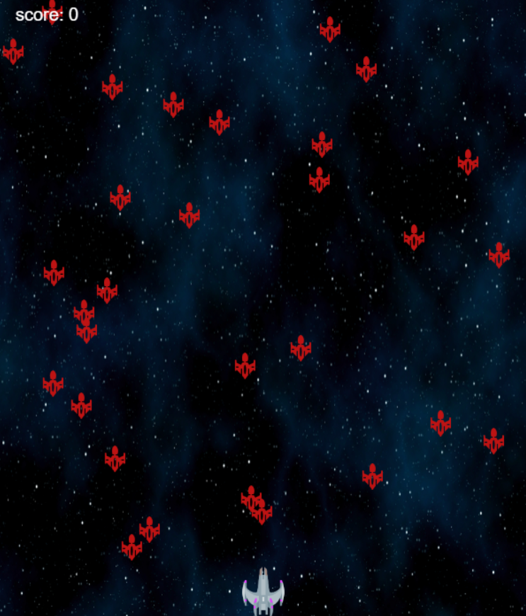

# 플레이 하기🛸
수정중입니다~~ 정상적인 플레이 x
[Play!](https://shooting-game-js-sand.vercel.app/)

</img>

 

# 게임 레시피🍦

1. canvas
2. 배경, 우주선, 총알, 적우주선 등 이미지 재료 준비
    - canvas와 이미지는 한번 호출하는게 아니라 애니메이션처럼 프레임 단위로 띄워줌
3. 키보드 움직임에 따라 우주선 조정
4. 총알 적우주선 constructor 기계 사용하여 찍어내기
5. 총알 적우주선 배열에 추가, 제거 
6. 총알이 적우주선에 닿으면 둘다 제거하고 score++;
7. score 점수에 따라 목숨 증가 (최대 +1)   
8. 목숨이 -1이 되면 게임 종료
9. score 200이 되면 엔딩
10. 밸런스 조정

 

# 배운거🐥
 - canvas (html5부터 도입됐는데 웹에서 그림이나, 게임 구현하기 좋다고함~ 실제로 좋았음!)
 - 변수 선언 & 값 할당 방법
    - 선언하고 다음에 살 붙여주는 식으로 코드 안짜봤던거 같음
 - addEventListener("keydown"으로 객체에 담았다가 "keyup" 으로 객체에 담은거 제거하는거 신선했음 ) 
 - 총알이랑 적 우주선 객체 기계로 찍어낸게 큰 수확 
    - constructor 문법 공부만 해봤는데 적용해보니까 좋았음, 그래도 class 못 써본건 아쉽네
 - requestAnimationFrame(main)으로 본인 함수 프레임단위로 계속 실행시키는거 진짜 신선했음 
    - 조금만 프로젝트 커져도 프레임 한도 걸어줘야 최적화 될듯 
